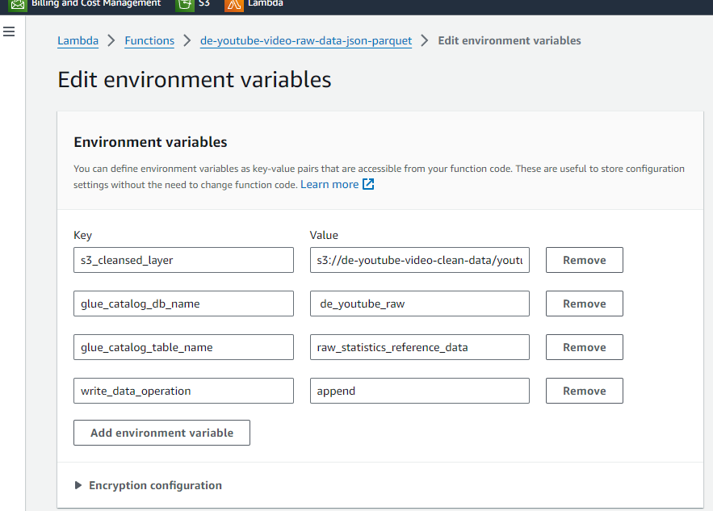
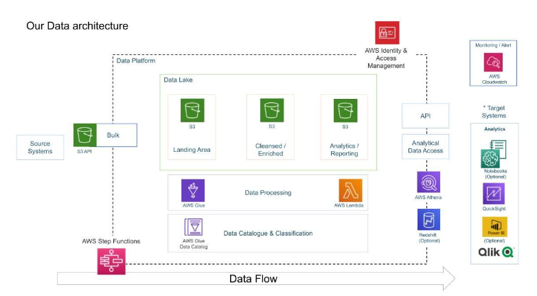

Most of the code and instruction were taken from 
https://github.com/darshilparmar/dataengineering-youtube-analysis-project/tree/main

Look at his github and YT Video.

- have AWS account
- Create S3 Bucket and download aws CLI
- download data set from https://www.kaggle.com/datasets/datasnaek/youtube-new
- exceutice commands in shell file
- after all data uploaded to s3 bucket
- go to aws glue and add new crawler, you will have to add an iam role and create database.
- after 1 minute, the craweler will be finsihed and u will find a table created in your database
- click on action and view data, and it will open aws athena
- edit settings on athena and create new bucket de-youtube-video-raw-data-athena-job
- put it as query result
- it will show error since there are CR / LR in the json
- We have to create a light ETL to format the json
- create lambda de-youtube-video-raw-data-json-parquet and give s3 full access to it
- put the code to lambda function
- configure environment variables as following

- Add layer to lambda awssdkpandas python 3.10 version

Skills Learned
- athena, glue, lambda, s3, 

Archicture
